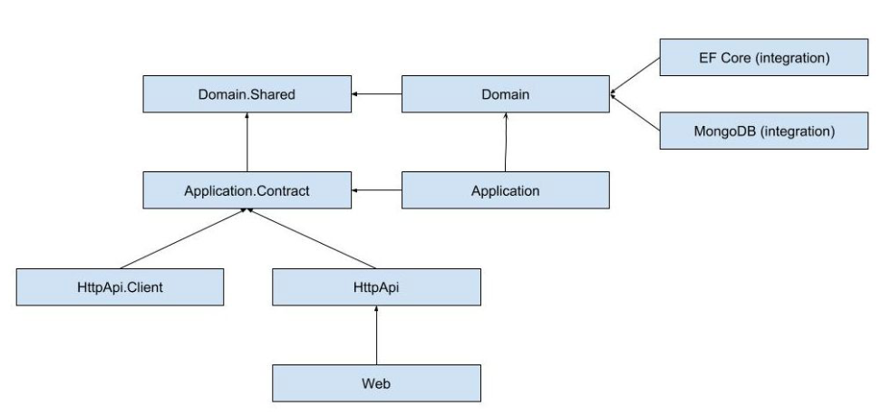



# 使用方法
Nuget restore然后打开TODO,基本是要改或者要注意的地方
目前没有实现：DB集成，认证登录模块

# Abp的优缺点

优点：
1. 可以免费可以收费，收费可以支持更多模板和收费功能，后端可以不选择Abp的框架，两个简单的服务器就够了。
   免费版本是LGPL3
   目前，我们选择免费版本就够用了：https://github.com/abpframework/abp?tab=LGPL-3.0-1-ov-file#readme
2. 功能强大，多种组件都在Abp直接有，架构关注的核心是业务层，具体的业务逻辑怎么实现，UI甚至可以无缝替换到HTML,做到前后分离

缺点：
1. DDD本身有一定的学习成本，比较复杂，尤其是WPF abp需要一些额外开发实现更强大的功能
2. 对于目前的应用来说，这个架构太过了，虽然我觉得有很好的延展性是绝对优点，但是否是缺点还需要你们再判断

# Wpf UI的优缺点

优点：
1. 原生使用CommunityToolkit.MvvM，基于这个MvvM实现了很多封装，导航，DialogService等虽然没有Prism强，但是轻量可定制，灵活度高
	虽然手写这些服务不难，但是集成在框架里也是好事
2. 虚拟化支持VirtualizingPanel,性能和包大小都不错，不如收费库的虚拟化支持好，原生支持Icons, ThemeManager等
3. 界面好看，模仿的FluentUI风格，更像Win11原生Ui,虽然在Net9马上就会有，不过做的还是不错的

缺点：
1. bug多，经常遇到一些奇怪的控件错乱
2. 文档之前看写的不太好，虽然Demo做的不错
